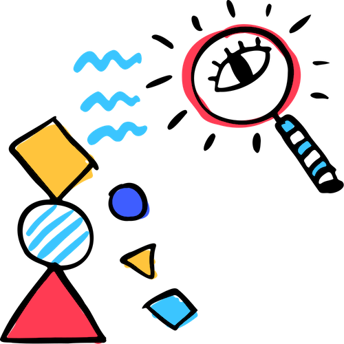

## Introduction

How do you quickly test ideas in your product? How do you include analytics in your day-to-day development process? How do you embrace failure and stop investing in something that’s not working?

::: {.column-margin}
{width="150" height="auto"}
:::

When really zoomed out, a common workflow in engineering teams looks like this: **“Idea -> Implementation.”** Work is usually done in short cycles to provide fast feedback loops. But generally, you take an idea, and you implement it.

This comes with two dangerous assumptions:

- that you already know what to build; and
- that everything that you start building needs to be built up to some final readiness.

While these might have been fairly safe assumptions in some industries some years ago, it’s hard to find anything further from the truth today. Products are rapidly evolving, becoming more complex, becoming smarter. User expectations are growing at an even faster pace. It’s close to impossible to predict whether a new feature will have an impact just by relying on your gut feeling.

## Hedge your risks

I’ve been working in product teams whose solutions rely heavily on data (recommendations, personalization) so that outcomes are not possible to predict (in recommenders, even offline metrics cannot give any guarantees) and iterations take a long time. In such setups, making a wrong assumption and sticking to it till the end brings the worst possible return on investments. There is also a lack of common ground in scope definitions between team members. Often, we just wanted to quickly test the feasibility of an idea, but it turned into a multi-month project that ended up being a disappointment for everyone.

It was clear that we needed a common language among engineering, data and product to save us from making costly bids while maximizing learnings. So we came up with a workflow that allowed us to speak the same language and that specified what the focus should be at each stage of the project.

## A common dictionary

The flow starts with the **hypothesis**. This is a small but important difference. A hypothesis, by definition, is something that doesn’t have certainty in itself. It can be right; it can be wrong.

Implementation becomes three separate steps:

- **Prototype**. Here you do more analysis, do some research (by this I mean just google whether you can already reuse something) and build a minimal prototype to test the hypothesis. It might require coding, but even that’s not strictly necessary. You cut all the corners to be able to test it faster.
- **Experiment**. Only if the prototype looks promising, start thinking about designing an experiment using it. Again, you aim at testing to collect feedback from real users as fast as possible. Sometimes, even testing it on your colleagues might give you enough information.
- **Productionize**. Only if the experiment ends up being positive and the ROI outweighs the potential implementation and maintenance costs, start investing in productionizing your prototype and embedding it natively into the product.

## Optimize time to value
In the figure below, you can see that it’s possible to **“short-circuit”** the flow. And this, possibly, is the single most important part of it.

If, in the prototyping phase, either the additional analysis or the first draft shows that it doesn’t make sense to move forward? Go back and adjust your hypothesis with the new learnings. If, after the experiment phase, there is no expected uplift – no worries, just go back and tune your hypothesis.

All of these allows us to save costs, possibly in the most expensive parts, and to **improve time to value**. Time to value is a commonly optimized metric that measures the length of time necessary to realize the benefits of the solution.

And your actual savings will be even greater than you see in the figure above, because each of the following components is potentially bigger in time investment than the previous one. Of course, it will strongly depend on the change you’re making, but generally it’s easier to create a prototype than to productionize it.

## Conclusion

This framework doesn’t command you HOW to build your product. Instead, it guides your thinking into WHAT is the most meaningful thing to work on at any particular moment. This allows you to hedge product risks while maximizing learnings, build a common dictionary within a team and optimize time to value.

Since it serves only as guidance, it can also work together with scrum, radical focus or any other process you’re using. No need to break what’s already working.

I'm going into more details about how to generate hypotheses and about each of the steps in the book I'm working now. It's called **Hypothesize!** and you can [pre-order it now at half price](https://gumroad.com/l/SSTiNM/kwfh1gn). 

_Note that you will only get charged after the release date._