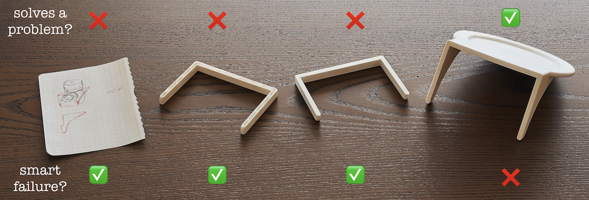
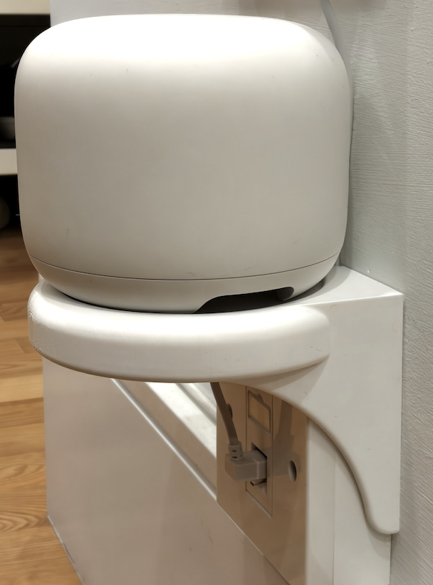

## Iterating

**building small things - proving myself wrong cheaply and quickly - building competence and maintenance**

***

## Setup

We've just moved and a broadband socket is in a very interesting place in the corridor. Should I move it or can I come up with something? Here is a quick story of me tinkering my way into a 3d-printed stand for a WiFi router.

](spotify-dev-fr.png){width="350" height="auto"}

There is a framework made famous by the Spotify folks about keeping users happy while iterating on a product and not overthinking it. I love this approach. But it starts with a skateboard. And how do you get to a skateboard? We often fall into thinking about some objects like they were always there while there is a great interesting invention story behind almost everything, especially skateboards.

Here is how I expanded the framework to the left:

### 1: Thinking on paper

There are some good models on Printables/Makerworld but not for my specific router. The few others I found online wouldn't work too due to my socket layout. _A perfect opporutnity to tinker._

My initial thinking is to make something simple to avoid any additional connections. Ideally it just uses socket parts to hold its weight. The simpler the design, the fewer things to worry about later (e.g. no need to patch any holes in the wall in case I decide to move or change it later).

### 2&3: Two minimum failable attempts

_How can I prove myself wrong quickly/cheaply?_ How can I test that it will fail while using the least material? I'm trying and testing the first connection failure point before going further. It's not a skateboard at all. But I learned a few weak spots already and saved time and material. Failure here would be to spend 3x filament without nailing the fundamentals.

### 4: Skateboard

Finally, I'm in skateboard territory. Something is useful for intended purpose. It's not perfect. Wires are all over the place. But the problem is solved at least for my robovac who can now safely do his job.

Next I added a compartment to hide wires and a few niceties - a cable groove, a rounder shape, and a slightly reduced footprint. That's a good skateboard and maybe even a scooter now.

## Build vs Buy

Watching an amazing video from [Scott Yu-Jan](https://www.youtube.com/watch?v=W9K-JoGDvxo) I was surprised that he mentioned people were challenging on why not to buy something already made? 

Optimizing everything, outsourcing what's not core - these habits are engrained too deeply at this point. While great for efficiency it removes the element of discovery and a personal competence growth opportunity. 

Building and fixing small things is what connects us to the real world. There are also positive inner-self effects - confidence that comes from being able to do or fix something. I'm reading [Maintenance: Of Everything](https://press.stripe.com/maintenance-part-one) now, and here is what the only person to finish the first solo round-the-world yacht race after pumping out three tonnes of water and spending three hours daily on just repairing his sails:

> I realized I was thoroughly enjoying myself.
> The only way to overcome my present feeling of depression is to fully occupy myself... Doing maintenance cures depression.

Maybe we all need just a tiny bit of illogical and unoptimized activities in our lives?

{width="350" height="auto"}
