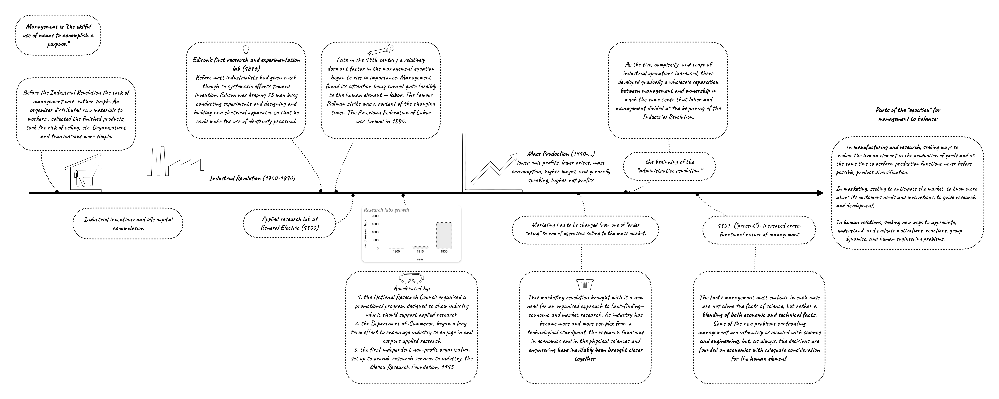

*My graphical representation of the [paper](https://dl.acm.org/doi/10.1145/1434821.1434825):*

[{fig-align="right"}](mgmt-history.png)

Really interesting to see how research came into a “normal” state of business. I thought such things mich come naturally to the business as a market pull. However, you can see the role individual and government incentives have played to create the environment that would set up American companies for success for the next century.

> - Before most industrialists had given much thought to systematic efforts toward invention, Edison was keeping 75 men busy conducting experiments and designing and building new electrical apparatus so that he could make the use of electricity practical.
> - The rise of industrial research during the past thirty years as a factor in the management equation was brought about, or at least was accelerated, by a number of well planned actions outside of industry itself.
>   - During the decade of the twenties, the National Research Council, through its Division of Engineering, conducted an organized promotional program designed to show industry why it should support applied research in its own interest.
>   - Furthermore, the Department of Commerce, under Mr. Hoover's Secretaryship, began a long-term effort to encourage American industry to engage in and support applied research.
>   - One other major development should be mentioned. The first independent non-profit organization set up to provide research services to industry, the Mellon Research Foundation, came into being in 1915.

Very interesting to see the logical sequence leading to the creation of “tech”: scarcity → abundance → need marketing to sell → more complex and fact-driven products → requires cross-functional collaboration → “techno-economics”.

> - The use of automatic machinery resulted in tremendous increases in productivity per man ... [which gave birth to] the idea of mass production, lower unit profits, lower prices, mass consumption, higher wages, and generally speaking, higher net profits.
> - marketing had to be changed from one of "order taking" to one of aggressive selling to the mass market. Some of the great names in business over the last few decades are to
> - This marketing revolution brought with it a new need for an organized approach to fact-finding—economic and market research. The idea developed slowly—first in the eastern part of our country, then in the West. As industry has become more and more complex from a technological standpoint, the research functions in economics and in the physical sciences and engineering have inevitably been brought closer together. The resulting approach is now known in some quarters as "techno-economics."

This also drives the change in the organisational structures, creating the demand for the development of the data industry:

> - As the size, complexity, and scope of industrial operations increased, there developed gradually a wholesale separation between management and ownership in much the same sense that labor and management divided at the beginning of the Industrial Revolution.
> - New types of instrumentation and devices of all sorts are being created to produce more complex products in greater quantities at lower cost.
> - The economist, the marketing research specialist, and the statistician are teamed with engineers, scientists, and mathematicians to refine the marketing factor in the management equation to a more exact point.
> - In human relations, management is seeking new ways to appreciate, understand, and evaluate motivations, reactions, group dynamics, and human engineering problems, whether they involve workers, executives, customers, or the general public.
> - effectiveness of communication, the quality of leadership, the temper of employee morale, the adjustment of men to machines and of machines to men, and the significance of the working environment can be analyzed, interpreted, and predicted.
> - This trend brings an ever-widening and more urgent demand on the part of management - for facts—economic facts about production costs and schedules, market potentials and requirements, inventories and prices; - technical facts about new products and processes; - and social science facts about people and their patterns of behavior.

Considering recent tech layoffs and general rethinking of the effectiveness of latge orgs, this quote is quite timely:

> In attempting to achieve a more efficient operation to go along with the increasing complexity of industrial affairs, management has also given serious thought during recent years to the size and location of its organizational units. We hear more about the problem of size versus morale and efficiency. Some companies have taken the position that definite limits should be placed upon the size of a single operating group. Others are striving to place parts of their organization in suburban settings.

Administrative revolution ...

> it is conceivable that future business historians will know this period as the beginning of the "administrative revolution."

Here is also a thread with a few more excerpts:

<blockquote class="twitter-tweet">
With seemingly lots of mismanagement happening recently, I got curious about the history of management, and found the industry view from 1951 - a paper called &quot;New equations for management&quot;. Here is a visual summary I made, and a few excerpts from the paper I found interesting / <a href="https://t.co/kMYTWI4PSl">pic.twitter.com/kMYTWI4PSl</a>
&mdash; Elias Nema (@eliasnema) <a href="https://twitter.com/eliasnema/status/1621149904424013824?ref_src=twsrc%5Etfw">February 2, 2023</a></blockquote> 