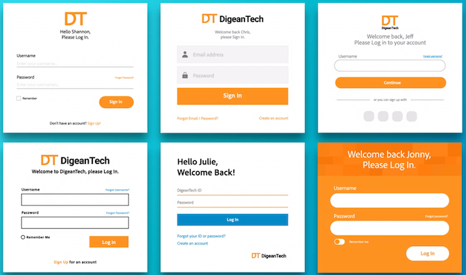

Is no code the new oil or the old ETL? TikTok's recommender and when to use machine learning.

## 📵 No Code

* When AWS launches a service, there is usually good economics behind it. Recently they’ve launched the [no-code way to build simple mobile apps](https://www.honeycode.aws/). It continues the trend started by Notion, Airtable and the likes of building your own productivity tools (of course, AWS is not competing against the Notion but rather against Microsoft Power Apps here). Spreadsheets for the new era.
* The Russian design studio [was using AI](https://www.artlebedev.com/ironov/) as one of their designers for more than a year.
> ”This event marks the moment that the mass automation of creative processes becomes a reality for businesses.”
* [MonkeyLearn raises 2.2M$](https://techcrunch.com/2020/07/07/monkeylearn-raises-2-2m-to-build-out-its-no-code-ai-text-analysis-service/) - not really no-code AI, rather NLP as a service.
> “Our vision is to make AI approachable by providing a toolkit for teams to actually use AI in their daily operations,” Garreta said in a release.
* Adobe keeps investing in its Sensei AI platform adding seamless no code [personalization and recommenders](https://www.adobe.com/marketing/target.html#demo) based on AL and ML, of course. Allows you to automatically A/B test different content variants and more.

## 🎛 ML Applications

* Facebook will [prioritize original reporting](https://about.fb.com/news/2020/06/prioritizing-original-news-reporting-on-facebook/) in the home feed. To identify originals it will look at how often the article is cited as … original.
* [A nice launch on ProductHunt](https://www.producthunt.com/posts/virtual-models-by-rosebud-ai) using GANs to generate models (real ones) for “photoshoots“. Even though the demo is far from perfect. But with the recent e-commerce rise, covid restrictions and all the shopify storefronts, this might be a promising direction. If the model (ML model, in this case) economy can be figured out.
* TikTok’s recommenders are apparently really good:

<blockquote class="twitter-tweet">
According to my teenagers, Tiktok has by far the best personalized <a href="https://twitter.com/hashtag/RecSys?src=hash&amp;ref_src=twsrc%5Etfw">#RecSys</a> they have used. Do we know anything about what they are doing?
&mdash; Xavier Amatriain - 🌈💪🏿 (@xamat) <a href="https://twitter.com/xamat/status/1282467657535467520?ref_src=twsrc%5Etfw">July 13, 2020</a></blockquote> 
And my thread about their recent article about how their recommender works:

<blockquote class="twitter-tweet">
<a href="https://twitter.com/hashtag/Tiktok?src=hash&amp;ref_src=twsrc%5Etfw">#Tiktok</a> has posted an article about their <a href="https://twitter.com/hashtag/recommendations?src=hash&amp;ref_src=twsrc%5Etfw">#recommendations</a> system. There aren&#39;t too many details, but some interesting quotes on how they think about the problem space. (1/)<a href="https://t.co/Ou8LfBGjUe">https://t.co/Ou8LfBGjUe</a>
&mdash; Elias Nema (@EliasNema) <a href="https://twitter.com/EliasNema/status/1278803346321801217?ref_src=twsrc%5Etfw">July 2, 2020</a></blockquote> 

## 👔 Why ML is Similar to Interns

Finishing with an interesting tweet from Benedict Evans:

<blockquote class="twitter-tweet">
I quite often describe machine learning as giving you infinite interns. This can be a useful way to look at how ML would affect a product: sometimes having infinite free interns to look at data for you wouldn’t actually solve your problems, and the struggle is something else.
&mdash; Benedict Evans (@benedictevans) <a href="https://twitter.com/benedictevans/status/1280265572782145537?ref_src=twsrc%5Etfw">July 6, 2020</a></blockquote> 

I think this is a very good summary for execs who don’t have exposure to the topic. Or for product managers when thinking about prioritization. Very often people tend to forget that ML is about **automation**. Imagine, you have an amazing photo-artist, who can look at the photos you take, pick the best ones, adjust brightness here and there, suggest collages, design a photo book and send to you. This is an awesome service, but also a very expensive one. How about providing it to a billion people? Hence, **Google Photos** cannot compete with the quality of the artist but can provide the service to a billion customers. Same goes for recommendations: a good stylist can probably get you a fashionable outfit, but economics cannot beat the recsys approach (or it can if you are a boutique).

On the other hand, problems where many agents won’t help, such as: shall we launch in the new market, how will customers react to a new feature? These are non-scalable problems. And even if you can and should use data to make a conscious decision there, investing in the ML solution won’t bring benefits.

Too often people confuse the need of **scaling the decision** (good for ML interns) with the need of **taking a good decision from time to time** (ML is of no use here).
