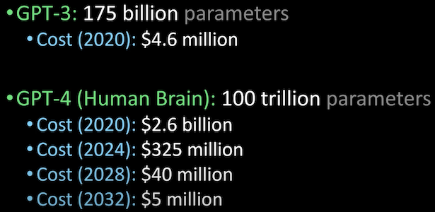

## Metadata, Medical Data and TF.Data

Announcements in the metadata management from Shopify and Stripe. What it takes to build a startup in the field of medical AI, and how much time you'll spend gathering data for it. TensorFlow's latest release was mostly about its data API.

## 🩺 AI in Medicine

Highly recommend the [Data Futurology podcast](https://www.datafuturology.com/podcast/2020/7/14/127-reinventing-prostate-cancer-testing-with-ai-from-development-to-regulation-to-production-with-elliot-smith-ceo-amp-founder) about what it takes to build an AI company in the medical sphere. Many interesting things, but what it takes to build real-world datasets in the wild is always worth hearing:

* “There is a lot of differences in medical data — if you did MRIs in two different centers, you cannot just take data from both of them and use it.”
* “Another under-appreciated aspect of building a lot of real-world AI applications, where, unlike kaggle, nobody’s got a 100 thousand in a nicely organized folder... Sometimes only having data for 10 patients at a time, scans coming on CDs, 1 at a time.”

> “As much as our system involves AI and image processing there is probably just as much if not more work in around data standardization, data cleanliness and manual intervention into data.”

* 2.5 years (from 5!) were spent on building a political relationship (with doctors), gathering data piece by piece, later building integrations with existing systems.
* “The best results were coming from building a relationship with individual doctors.”

To sum it up, I think that data gathering relationship building is **the new sales**. Building a company that relies on data, you are as good as the number of data providers you've built a relationship with.

## 📼 Metadata

Two of the big players have released something about their metadata solutions. Many of the big players already have established solutions for a couple of years, with Shopify being the latest company to build their own.

### [Shopify's Artifact](https://engineering.shopify.com/blogs/engineering/solving-data-discovery-challenges-shopify)

* Their implementation uses Elasticseach and a graph database to provide search and data lineage respectively. GraphQL's Apollo as an API layer. Quite a standard stack. Similar to e.g. [this one](https://lyft.github.io/amundsen/architecture/).
* Other than that, from the screenshots it looks like it does what it should and looks very much like similar systems. However, a quote from the article explaining why it's generally hard to reuse existing solutions:

>Every organization’s data stack is different. While some upstream processes can be standardized and cataloged appropriately, the business context of downstream processes creates a wide distribution of requirements that are near impossible to satisfy with a one-size-fits-all solution.

### Stripe and Privacy

[Stripe is using](https://developer.squareup.com/blog/using-amundsen-to-support-user-privacy-via-metadata-collection-at-square/) their [Amundsen](https://lyft.github.io/amundsen/) metadata tool to increase focus on consumer privacy and better comply with GDPR and CCPA.

### Other companies

A collection of [data discovery articles](https://github.com/eugeneyan/applied-ml).

## 🖇 Tensorflow 2.3

Ironically the [latest TensorFlow release](https://blog.tensorflow.org/2020/07/whats-new-in-tensorflow-2-3.html) is also about data. Two of the main additions to the help make preprocessing smoother. I think preprocessing may very well be the most overlooked step and improving it is hugely beneficial.

* **td.data.snapshot**: allows you to run the preprocessing pipeline once, save the output and play with parameter optimization on top of that. Read more details in the [RFC](https://github.com/tensorflow/community/blob/master/rfcs/20200107-tf-data-snapshot.md).
* **[Preprocessing layer API](https://www.tensorflow.org/api_docs/python/tf/keras/layers/experimental/preprocessing?version=nightly)**: package preprocessing logic inside a model for easier deployment.

---
 

To finish on a positive note, here is an awesome 3 minutes [Lex Fridman's video](https://www.youtube.com/watch?v=kpiY_LemaTc) estimating costs for GPT to equal a human brain:

