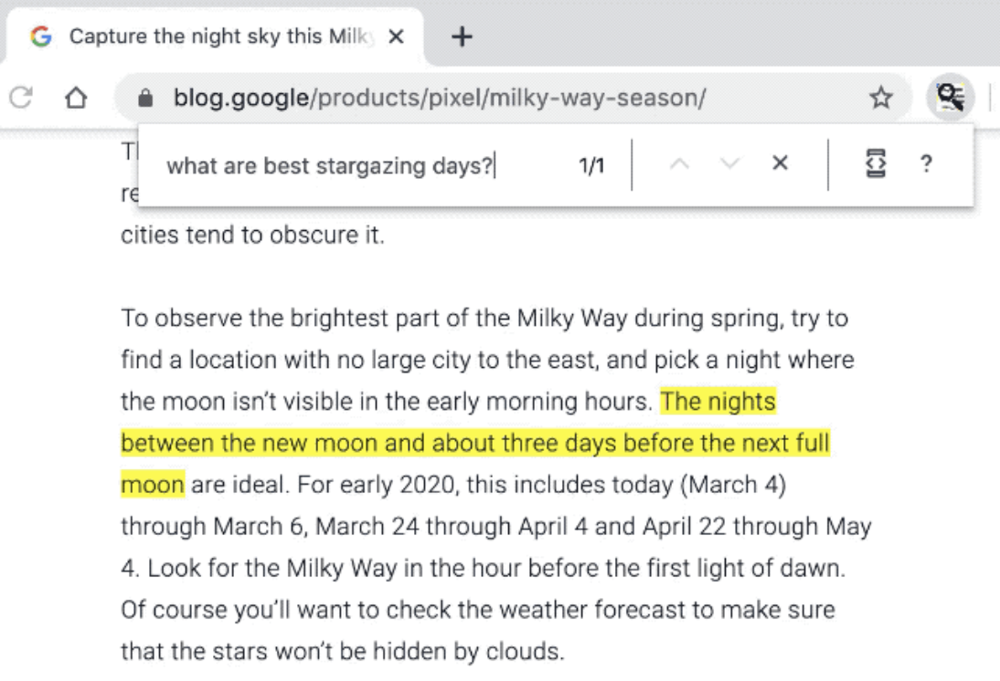

## Democracy and Efficiency

The AI has already proven to work well for many tasks that were not possible to tackle with computers before. Now we've entered the scaling phase to make it:

* as accessible as possible (developer tools, explainability, the **“democratization of ML”**) and
* putting it on as many devices (**model efficiency**) as possible.

Hence, more and more ready-to-use recipes are created, frameworks are hiding complexity, and, pre-built models are optimized and ready to be served on all kind of devices.

## Recommendations

### TFRS

This one is huge for the RecSys community. Google adds recommendations package into the tensorflow, *that makes building, evaluating, and serving sophisticated recommender models easy* (this is to the point of democracy).

This also involves [Maciej Kula](https://twitter.com/maciej_kula?lang=en), author of a couple of hugely popular reco libraries: [LightFM](https://github.com/lyst/lightfm) and [Spotlight](https://github.com/maciejkula/spotlight). So it promises to be a very elegant API.

And you can see how easy it is to create even a [multitask-system](https://www.tensorflow.org/recommenders/examples/multitask). Here is a code snippet to define two learning tasks, one to predict ratings, another to predict the amount of relevant movies:

```python
tfrs.tasks.Ranking(
    loss=tf.keras.losses.MeanSquaredError(),
    metrics=[tf.keras.metrics.RootMeanSquaredError()],
)

tfrs.tasks.Retrieval(
    metrics=tfrs.metrics.FactorizedTopK(
        candidates=movies.batch(128)
    )
)
```

Then you can combine these tasks while computing the loss and adjust the weight accordingly. It's like Lego for recommendations.

### LinkedIn's Intents

A couple of years ago, LinkedIn has joined a cohort of companies that are doing recommendations by intent (members, pages, hashtags, newsletters, etc. in this case) on the main page. Here is a [story of how they did it](https://engineering.linkedin.com/blog/2020/helping-members-discover-communities-around-interests). Some highlights:

* **UI framework:** to be able to quickly switch between recommendation types in the frontend, a unified framework for all the platforms.
* **[Micro]-Services:** different services for different recommendations with a unified ranker component on top of them. Allows to quickly plug-and-play different algorithms.
* **Unified tracking:** so often overlooked but such an important mention.

## Efficiency

### NVIDIA

Following-up on the [last week's video topic](https://www.eliasnema.com/data-meets-product/2020/09/22/newsletter-video.html). Building an ML application on top of a video stream is not something easy and requires expertise in multiple domains. So [NVIDIA wants to help](https://developer.nvidia.com/blog/deploying-models-from-tensorflow-model-zoo-using-deepstream-and-triton-inference-server/) you make deployment of such kind of applications easier. This also falls into the **“democratize”** suit. Here is an excerpt from [their other article](https://developer.nvidia.com/blog/implementing-a-real-time-ai-based-face-mask-detector-application-for-covid-19/), explaining how to build a real-time face-mask detector application:

> To use TLT [NVIDIA's transfer learning tool] and DeepStream you do not necessarily have to know all the concepts in depth, such as transfer learning, pruning, quantization, and so on. These simple toolkits abstract away the complexities, allowing you to focus on your application.

So the modern-day workflow for the AI video app can look like this:

```text
Download a pretrained model
            |
            |--> Get data for your use case
                        |
                        |--> Retrain (Transfer learning) & Prune
                                    |
                                    |--> Export model and use with DeepStream library
```

I want to point the `Prune` part, which is becoming more and more relevant for the production systems. And there are many ways to do it, some I've covered in a [previous post](https://www.eliasnema.com/data-meets-product/2020/07/20/newsletter-gpt.html), but you can also check [NVIDIA's blog post](https://developer.nvidia.com/blog/transfer-learning-toolkit-pruning-intelligent-video-analytics/).

Why is it important? For example, in the face-mask detection example running on a Jetson Nano after pruning the mean average precision has **dropped from 86.12 to 85.5%**, while frames per second **increased more than 3 times** — from 6.5 to 21.25.

This doesn't even feel like a trade-off!

Here is also a free course from them to get started with video analytics: [Getting Started with DeepStream for Video Analytics on Jetson Nano](https://courses.nvidia.com/courses/course-v1:DLI+C-IV-02+V1/about).

### TFLITE's NLP

And more on the topic of efficiency. Google has [added many things around NLP into the TF Lite](https://blog.tensorflow.org/2020/09/whats-new-in-tensorflow-lite-for-nlp.html).

So that it's easier to do things like that in your browser:


*Image from [this blog post](https://blog.tensorflow.org/2020/03/exploring-helpful-uses-for-bert-in-your-browser-tensorflow-js.html) about the in-browser BERT.*

And these capabilities are also unlocked by the pruning and quantization. Just take a look at how much more efficient the model becomes after losing only a fraction in accuracy:


## Pixar

And after some philosophy let's end when it's best. If you always wondered how would you look like a Pixar character, now you have a chance [to see that](https://toonify.justinpinkney.com/).
As well as an informative [conversation with its creator](https://www.youtube.com/watch?v=KZ7BnJb30Cc).

<blockquote class="twitter-tweet"><p lang="en" dir="ltr">Blending humans and cartoons using <a href="https://twitter.com/Buntworthy?ref_src=twsrc%5Etfw">@Buntworthy</a>&#39;s Google Colab notebook. Thank you for that, it&#39;s awesome. Here is a YouTube version of this video: <a href="https://t.co/7bUd7nXaX3">https://t.co/7bUd7nXaX3</a> <a href="https://t.co/iG09lpEAXX">pic.twitter.com/iG09lpEAXX</a></p>&mdash; Doron Adler (@Norod78) <a href="https://twitter.com/Norod78/status/1297513475258953728?ref_src=twsrc%5Etfw">August 23, 2020</a></blockquote> <script async src="https://platform.twitter.com/widgets.js" charset="utf-8"></script>
