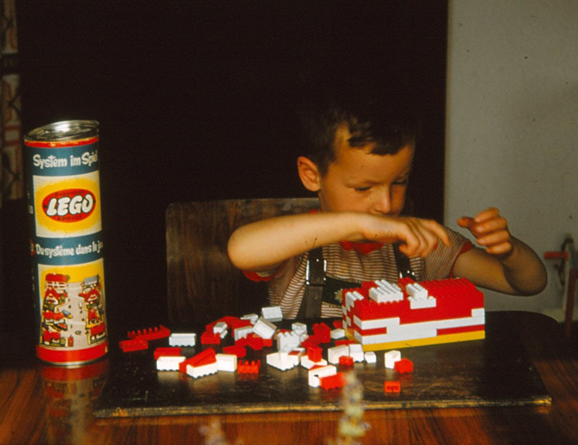

## Agency

**study or avoid studying - apathy through millenia - James Bond - instructions - calculator - algos - deus ex machina**

***

Kids lack agency to either study or avoid studying, i.e. choosing to do something instead. But it's a story as old as civilization. Socrates and Alcibiades. Only that the teacher's prompting and steering facing a wall of _apathy rather than life (like Alcibiades)._ While the pupil is not willing to try anymore overwhelmed by the world and its pointlesness, lacking the willpower to change anything. As in Greek tragedy, both see the inevitable failure but cannot alter the structures that seal their fate.

<blockquote class="twitter-tweet">
I maintain it&#39;s not a matter of horsepower (low iq etc) it&#39;s habituation to not engage with the littlest mental lift, plus social contagion into complacency. E.g. a couple of kids scoff at the ask to figure out a limit numerically the rest just freeze like..just give us the rule,… <a href="https://t.co/PFdQlludQN">https://t.co/PFdQlludQN</a>
&mdash; Violeta𓅓 (@MamanLunettes) <a href="https://twitter.com/MamanLunettes/status/1971982191904059580?ref_src=twsrc%5Etfw">September 27, 2025</a></blockquote> 

Another term that has survived through two millennia is *“acedia,”*[^acedia] which is one of the main themes of [Ian Fleming’s](https://literary007.com/2015/04/23/the-spectre-of-accidia-bond-and-flemings-greatest-foe/) Bond books or described as the main sin by [Evagrius Ponticus](https://en.wikipedia.org/wiki/Evagrius_Ponticus) in the 4th century.

## Discovery

At school open days we watched kids slot CPUs and RAM into motherboards. It wasn't a big deal, especially for the kids. But it reminded me of the time I was building my first computer. I had to learn and try things, no manuals, no youtube tutorials. It _was_ a big deal. A journey of figuring things out. Trying things adds meaning regardless of the result. 

> Trying things adds meaning regardless of the result

Now it’s instructions all the way. Someone has already mapped the errors, optimized the plan, wrapped discovery in bubble wrap.

Even the coolest companies I absolutely love have fallen into this. Ultimately, the company that removes the most customer pain earns more money and market share.

Lego is not about free play and discovery anymore it’s about following instructions as closely as possible.

{width="300" height="auto"}

Prusa and Framework also celebrate openness and tinkering, but often what they deliver is the illusion of discovery. A carefully designed kit that makes you feel like a builder, when really you’re just assembling someone else’s solved problem.

Food companies do this too: they “add” an extra step (crack your own egg, stir in the sauce) not because it’s needed, but because it preserves the illusion that you cooked something, rather than just microwaving a pre-made meal.

Instructions steal the joy of learning. Where else does apathy and discouragement come from?

## Algos

Whatever you do, someone else does it better, why even try? And this reminder is constantly at your fingertips, daily, hourly reminding. Sometimes, it motivates to improve and show what's possible. Most of the time it's just discoraging: people are already ahead of you, smarter, stronger, more beautiful.

## Deus ex machina

In the ’70s, calculators availability raised questions about humans becoming button pushers. We know that it didn't happen. But we also didn't stop teaching kids multiplication. The consensus was to teach kids to solve problems first then use calculators.

Until recently, modern-day calculators - phones - could fetch facts, but a slight twist in wording broke the search. Now models handle nuance: give them a problem and they can reason through it. Sometimes better than student or teacher. They’re still limited to common problems, but the range has exploded.

Augmenting yourself with a calculator was about learning calculus and then automating the hard parts. How do you toolify the AI? Do you learn all the world's context? *The mountain to climb just feels too high.*

> The mountain to climb just feels too high

## A niche

Find a niche. Make it yours. Outpace the machine at it. Wander where there are no manuals. Climb a step, but keep an eye on the peak. Let hope, struggle, and discovery, not cynical algos, consume you.

[^acedia]: [acedia](https://en.wikipedia.org/wiki/Acedia): spiritual or mental sloth; apathy